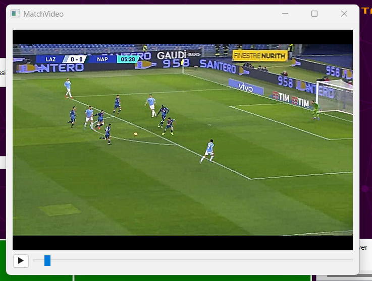
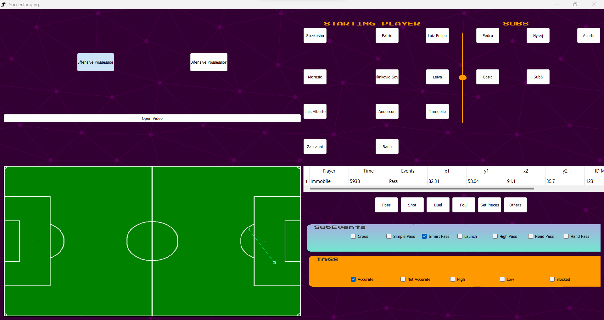

# Simple tagging software for football events

This repo allows you to create your own database of football events.





## Notes
The `requirements.txt` file should list all Python libraries that your notebooks
depend on, and they will be installed using:

```
pip install -r requirements.txt
```

## Setup

You must follow the following steps:

1. launch the `main.py` file;
2. left click on `Open Video` button, select video of match and insert the required info. After that you should have a new window with a media player. You can use keyboard shortcuts that is arrow right send forward the video, arrow left send backward the video and spacebar stop or restart the video;
3. right click on  `Player` button to insert player names of your team. 

## Usage

After finishing the setup, now you are ready !!
You should follow this steps:

* Select whether this is an offensive or defensive action with `Offensive Possession` and `Difensive Possession ` button rispectively. These buttons remain pressed until you deselect them or change to the other unselected one;
* Select player with left click on the `Player` buttons;
* Enter the coordinates of the event by double-clicking on the soccer field. The first click will be the start coordinates while the second click will be the end coordinates. If you clicked wrong, clicking again and you will restart.
* Select the type of event using the `Event` buttons. After that you can select additional information by selecting items in the sub-events and tags checkboxes.


Eventually if you are sure of the information entered with the `Enter` button the event will be stored in a json file with the same name as the match id.
